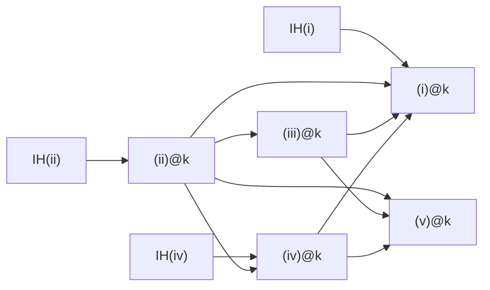
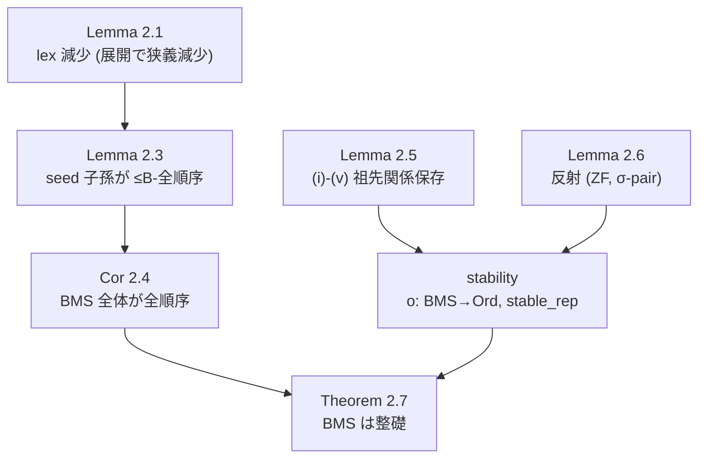

# Hunter Lemma 2.5 — 5 clause の正式記述

ブログ記号 ($\boldsymbol{S}$, $X$, $Y$, $S_{xy}$, $t$, $r$, $\Delta_y$, $A_{xy}$, $\boldsymbol{B}^{(a)}$ 等) を使用。

## 補助記号

### 行列・展開

- $\boldsymbol{S}$: BMS 行列 ($X$ 列 × $Y$ 行)
- $S_{xy}$: 列 $x$、 行 $y$ の値
- $\boldsymbol{S}[n]$: 展開 ($a = 0, 1, \ldots, n$ について $\boldsymbol{B}^{(a)}$ を生成して結合し、 strip 適用)

### 各種 index

- $r := P_t(X-1)$ (bad root)
- $l := X - 1 - r$ (悪部分の列数)
- $\text{idx}_G(i) := i$ (良部分の $i$ 番目列 → $\boldsymbol{S}[n]$ における列 index)
- $\text{idx}_B(a, j) := r + a \cdot l + j$ ($\boldsymbol{B}^{(a)}$ の $j$ 番目列 → $\boldsymbol{S}[n]$ における列 index)
- $\text{idx}_{B_0\text{-orig}}(i) := r + i$ (元 $\boldsymbol{S}$ における悪部分の $i$ 番目列)

### Parent / Ancestor (再掲)

- $P_y(\boldsymbol{S}, x)$: 列 $x$ の 行 $y$ における親 (定義はブログ参照)
- $\text{Anc}_y(\boldsymbol{S}, x, j) := \exists a \geq 1.\ j = (P_y(\boldsymbol{S}, \cdot))^a (x)$

## clause (i) — $G$ への祖先関係は block index に依らない

$$
\forall i, j.\ (i < r \land j < l) \implies
\Bigl[ \text{Anc}_k(\boldsymbol{S}[n],\ \text{idx}_B(0, j),\ \text{idx}_G(i))
\iff
\text{Anc}_k(\boldsymbol{S}[n],\ \text{idx}_B(n, j),\ \text{idx}_G(i)) \Bigr]
$$

## clause (ii) — $\boldsymbol{B}$ 内部の祖先関係は block index に依らない

$$
\forall i, j.\ (i < l \land j < l) \implies
\Bigl[ \text{Anc}_k(\boldsymbol{S}[n],\ \text{idx}_B(0, j),\ \text{idx}_B(0, i))
\iff
\text{Anc}_k(\boldsymbol{S}[n],\ \text{idx}_B(n, j),\ \text{idx}_B(n, i)) \Bigr]
$$

## clause (iii) — 元 $\boldsymbol{S}$ と展開後 $\boldsymbol{S}[n]$ の祖先関係対応

$$
\forall i.\ (n > 0 \land t\text{ は定義済} \land k < t \land i < l) \implies
$$
$$
\Bigl[ \text{Anc}_k(\boldsymbol{S},\ X - 1,\ \text{idx}_{B_0\text{-orig}}(i))
\iff
\text{Anc}_k(\boldsymbol{S}[n],\ \text{idx}_B(n, 0),\ \text{idx}_B(n - 1, i)) \Bigr]
$$

## clause (iv) — 最上位 block $\boldsymbol{B}^{(n)}$ の parent は中間 block に居ない

$$
\forall i.\ (0 < i < l) \implies
\Bigl[\ P_k(\boldsymbol{S}[n],\ \text{idx}_B(n, i)) = \text{None}
$$
$$
\lor\ \exists p.\ P_k(\boldsymbol{S}[n],\ \text{idx}_B(n, i)) = p
$$
$$
\land\ \bigl(\ \exists j < l.\ p = \text{idx}_B(n, j)
\lor\ \exists j < r.\ p = \text{idx}_G(j) \bigr) \Bigr]
$$

## clause (v) — block index の上方 shift で祖先関係が不変

$$
\forall i, j, n_0, n_1.\ (i < l \land j < l \land n_0 < n_1 < n) \implies
$$
$$
\Bigl[ \text{Anc}_k(\boldsymbol{S}[n],\ \text{idx}_B(n_1, j),\ \text{idx}_B(n_0, i))
\iff
\text{Anc}_k(\boldsymbol{S}[n],\ \text{idx}_B(n_1 + 1, j),\ \text{idx}_B(n_0, i)) \Bigr]
$$

## clause 間の依存関係

paper page 5-7 を精読した結果、 Hunter は universal ascending 仮定を使っておらず、 各 clause 内で「j 列が ascend するか否か」 の case-split を行う論法を採用していた。

## IH (induction hypothesis) の定義

各 clause を $k$ に関する well-founded < induction で証明する際の **IH (= 帰納仮説)** は、 同 clause を $k' < k$ 全てで仮定したもの:

$$\text{IH}_{(ii)}(k) \;:=\; \forall k' < k.\ \text{clause (ii) at } k'$$

$$\text{IH}_{(iv)}(k) \;:=\; \forall k' < k.\ \text{clause (iv) at } k'$$

$$\text{IH}_{(i)}(k) \;:=\; \forall k' < k.\ \text{clause (i) at } k'$$

clause (iii), (v) は同 $k$ の他 clause からの直接 corollary であり、 induction 不要なので自前 IH は存在しない。

展開すると IH(ii) は具体的に:

$$\text{IH}_{(ii)}(k) \;\equiv\; \forall k' < k.\ \forall i, j < l.\
  \text{Anc}_{k'}(\boldsymbol{S}[n],\ \text{idx}_B(0, j),\ \text{idx}_B(0, i))
  \iff
  \text{Anc}_{k'}(\boldsymbol{S}[n],\ \text{idx}_B(n, j),\ \text{idx}_B(n, i))$$

### 証明すべきは IH ⟹ clause の含意 (step lemma)

実際に労力を要するのは **step lemma の含意** であって、 単独の clause でも IH でもない:

$$\text{step}_{(ii)}(k) \;:=\; \text{IH}_{(ii)}(k) \implies \text{clause (ii) at } k$$

$$\text{step}_{(iv)}(k) \;:=\; \text{IH}_{(iv)}(k) \land (\forall k'.\ \text{clause (ii) at } k') \implies \text{clause (iv) at } k$$

$$\text{step}_{(i)}(k) \;:=\; \text{IH}_{(i)}(k) \land (\forall k'.\ \text{clause (ii)(iii)(iv) at } k') \implies \text{clause (i) at } k$$

(iii)(v) は IH なしの直接 step:

$$\text{step}_{(iii)}(k) \;:=\; \text{clause (ii) at } k \implies \text{clause (iii) at } k$$

$$\text{step}_{(v)}(k) \;:=\; \text{clause (ii)(iii)(iv) at } k \implies \text{clause (v) at } k$$

各 step lemma を証明後、 well-founded < induction wrapper で $\forall k.$ 化して main lemma を得る。

## clause (i)-(v) × IH の改訂依存マトリックス

行 = 「at $k$ で証明」、 左 5 列 = 「同 $k$ で使う」、 右 5 列 = 「IH at $k' < k$ で当該 clause を使う」。 `✓` = 依存、 `-` = なし。

| at $k$ で証明 \ 依存 | (i)$k$ | (ii)$k$ | (iii)$k$ | (iv)$k$ | (v)$k$ | IH(i) | IH(ii) | IH(iii) | IH(iv) | IH(v) |
|---|:---:|:---:|:---:|:---:|:---:|:---:|:---:|:---:|:---:|:---:|
| **(i)**   | - | ✓ | ✓ | ✓ | - | ✓ | - | - | - | - |
| **(ii)**  | - | - | - | - | - | - | ✓ | - | - | - |
| **(iii)** | - | ✓ | - | - | - | - | - | - | - | - |
| **(iv)**  | - | ✓ | - | - | - | - | - | - | ✓ | - |
| **(v)**   | - | ✓ | ✓ | ✓ | - | - | - | - | - | - |

### 旧版からの変更

- **(iv)**: 旧 `(iii) at $k$` 依存削除 (paper page 6: (ii) at k のみ使用)
- **(v)**: 旧 `(i) at $k$` 依存削除 (paper page 7: (ii)(iii)(iv) at k のみ使用)
- **(iii), (v)**: 自前 IH 不要 (= k-induction 不要、 同 $k$ の他 clause からの direct corollary)
- **(ii), (iv), (i)**: 各々自前 IH 要 (= 各自 k-induction)

### 依存図 (mermaid)

clause 間依存 DAG (上記マトリックスの図示; 矢印 = 「使う」)。



Lemma 2.5 の上位定理における位置づけ (paper §2 全体の依存)。



- Lemma 2.5 は安定表現 `stable_rep` の展開不変性 (`o(A[n+1])` 構成) に使われ、 Lemma 2.6 の反射と合わせて順序保存の ordinal 埋め込みを与える。
- 整礎性 = Cor 2.4 (全順序) + stability (ordinal への狭義単調埋め込みで整礎性を移送)。

### Hunter 論法の核心 (page 5)

> "either the k-th elements of all columns in B_0 with indices in **I** ascend or the k-th element of the j-th column in B_0 doesn't ascend"

ここで I = {i' < j : ∀k'<k. i' は j 列の k'-ancestor}。 (ii) at k の proof は I の ascending 状態で **2 case** に分割:
- **case (A)**: I 内全 col が row k で ascend → B_n で difference uniform → k-ancestry 不変
- **case (B)**: j 列が row k で ascend しない → B_n に新規 k-ancestor なし

(iii)(iv)(i)(v) も同様に per-col case-split (paper 該当箇所参照)。

### Layered な構築方式 (新方針、 simultaneous induction 不要)

```
ステージ 1: ∀k. (ii) at k   ← k-induction、 IH(ii) only
ステージ 2: ∀k. (iv) at k   ← k-induction、 IH(iv) + (ii) at all k
ステージ 3: ∀k. (iii) at k  ← 直接 corollary、 (ii) at k
ステージ 4: ∀k. (i) at k    ← k-induction、 IH(i) + (ii)(iii)(iv) at all k
ステージ 5: ∀k. (v) at k    ← 直接 corollary、 (ii)(iii)(iv) at all k
```

各 stage 独立に sub-agent 並列実装可能。

### 詳細

#### (i) at $k$
- IH(i) + **(ii) at $k$** + **(iii) at $k$** + **(iv) at $k$**
- 内容: G への祖先関係が block index に依らない
- paper page 7: "by (i) for k'" を明示使用 → 自前 IH 要

#### (ii) at $k$
- IH(ii) のみ
- 内容: B 内部の祖先関係が block index に依らない
- paper page 5: per-col ascending case-split で証明、 universal ascending 不要

#### (iii) at $k$
- **(ii) at $k$** のみ (自前 IH 不要)
- 内容: 元 array と展開後の祖先関係対応
- paper page 5: "trivially extended" — (ii) の proof を流用

#### (iv) at $k$
- IH(iv) + **(ii) at $k$**
- 内容: 最上位 block の parent は中間 block に居ない
- paper page 6: "by (iv) for k'" + "(ii) for k" を明示使用

#### (v) at $k$
- **(ii) at $k$** + **(iii) at $k$** + **(iv) at $k$** (自前 IH 不要)
- 内容: block index の上方 shift で祖先関係が不変
- paper page 7: "by application of (iii)" + "(ii) for k" + (iv) 使用

## Isabelle 形式化の進捗ツリー (BMS_Hunter.thy, 2026-05-25)

凡例: ✅ = sorry-free 完全証明 / 🟡 = 構造は proven だが下流 sorry に依存 (conditional) / 🚨 = 未証明 sorry / ⛏ = 帰着先の core / ✗ = 削除済 (偽命題)。lemma 名は `.thy` のもの。

```
BMS_Hunter.thy  ── Hunter Lemma 2.5 の paper-level 層
│
├─ 🟡 lemma_2_5_at_main          (k-外/n-内 同時帰納で 5 clause を組み立て)
│   │   ※ build green だが下記 clause step の open sorry に依存 (conditional)
│   │
│   ├─ 🟡 (ii) lemma_2_5_ii_main_v2  →  lemma_2_5_ii_clause_step
│   │        └─ b0_col_ancestor_below_t  ✅ (elem_lt から導出済)
│   │            └─ 🚨 elem_lt_below_t  ── m=0 ✅ / on-chain ✅ / off-chain 🚨
│   │                                      ⛏ CORE-A: domination (同時帰納の entanglement point)
│   │
│   ├─ 🟡 (iii) lemma_2_5_iii_clause_step   [uses (ii)@k + IH]
│   │        └─ 🚨 iii_single_step_t_to_Suc_t     ⛏ CORE-B: gateway/block-translation
│   │
│   ├─ 🟡 (iv) lemma_2_5_iv_clause_step      [uses (ii)(iii)@k + IH]
│   │        ├─ ✅ clause_iv_intermediate_B_t_impossible_at_zero
│   │        ├─ 🚨 ..._at_zero_outside_lands_in_G        ⛏ CORE-B
│   │        ├─ 🚨 m_parent_block_n_stays_until_zero     ⛏ CORE-B (→within-block monotone→CORE-A)
│   │        └─ 🚨 chain_through_Bn_first  ── vacuity sorry (真・0/14994)  ⛏ CORE-B
│   │            └─ ✗ idx_B_n_zero_no_intermediate_B_t_ancestor 削除済 (偽 T2)
│   │
│   ├─ 🟡 (i) lemma_2_5_i_clause_step        [uses (ii)(iii)(iv)@k + IH]
│   │        └─ 🚨 forward/backward × ascends/not_ascends (4本)
│   │                ⛏ CORE-B (clause iv と intermediate-block-exclusion core を共有)
│   │
│   └─ 🟡 (v) lemma_2_5_v_clause_step        [uses (i)-(iv)@k + IH]
│            └─ 🚨 lemma_2_5_v_clause_step_iff      ⛏ CORE-B
│
├─ 🟡 lemma_2_5_i / _ii / _iii / _iv / _v / _iv_and_v   (at_main からの projection、依存継承)
│
└─ ✅ paper proof 中の散文 claim (完全証明・sorry-free)
     ├─ ✅ hunter_ascends_iff_first_b0_ancestor
     ├─ ✅ hunter_first_b0_col_ascends
     └─ ✅ hunter_m_ancestry_total_on_ancestors
```

**要点**:
- 散文 claim 3本は ✅。組立 (at_main + projection) は build green だが全て下流の clause-step sorry に依存 (🟡 conditional)。
- 未証明 sorry は 2 core に集約: **CORE-A = elem_lt domination** ((ii) off-chain)、**CORE-B = gateway/intermediate-block-exclusion** ((iii)(iv)(i)(v))。CORE-B の within-block monotonicity は predecessor の elem_lt に帰着するので、究極的には全て CORE-A に収束。
- これらを閉じるには Hunter (i)-(v) の**同時 k-induction 忠実再構成** (multi-session) が必要。
