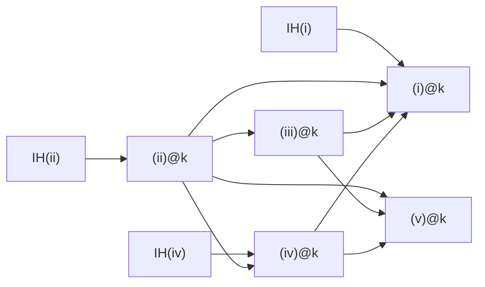

# タスクリスト

> **メモ**: 完了は ✅、 未完は 🚨。
> 各 commit が一次履歴であり、 本ファイルは概観用。
>
> **ルール**: タスク (✅/🚨 行) 以外の情報を書くな。 現状解説、 helper 詳細、 履歴、 比較表、 削除ログ、 axiom 集計などは task.md に書かず、 commit / コード / `important-lemma.md` 等の専用ファイルに残す。

## Hunter Lemma 2.5 (i)-(v) 改訂依存マトリックス

| at k で証明 \ 依存 → | (i)k | (ii)k | (iii)k | (iv)k | (v)k | IH(i) | IH(ii) | IH(iii) | IH(iv) | IH(v) |
|---|:---:|:---:|:---:|:---:|:---:|:---:|:---:|:---:|:---:|:---:|
| **(i) at k**   | -   | ✓ | ✓ | ✓ | - | ✓ | - | - | - | - |
| **(ii) at k**  | -   | - | - | - | - | - | ✓ | - | - | - |
| **(iii) at k** | -   | ✓ | - | - | - | - | - | - | - | - |
| **(iv) at k**  | -   | ✓ | - | - | - | - | - | - | ✓ | - |
| **(v) at k**   | -   | ✓ | ✓ | ✓ | - | - | - | - | - | - |

矢印は **prerequisite → consequence** (a → b は b が a に依存)。

帰結:
- k-induction が真に必要なのは (ii), (iv), (i) のみ (各々自前 IH 要)
- (iii), (v) は同 k の他 clause の直接 corollary (induction 不要)
- simultaneous induction 不要 — 各 clause を独立に layered で証明可能

## 統合ツリー

- 🚨 **Theorem 2.7**: BMS は整礎
  - 🚨 `stable_rep_extend_strict` Suc n' Some s case (BMS_WellOrdered.thy:410)
    - 🚨 g 構成: G_block には f、 B_i (i≥1) には Lemma 2.6 の Y' 反射値 [ID 12]
    - 🚨 g が stable_rep を満たす証明 (Lemma 2.5 本質的使用) [ID 13]
    - 🚨 β 構成 (Hunter handwave、 f の最大値を β に取る具体 indexing が論文未明示) [ID 14]
    - 🚨 反射構築本体: Lemma 2.6 適用 X/Y 具体化、 sigma_bound 検証、 g_{Suc n'} 定義、 stable_rep 検証、 β 選定 [ID 43]
    - ✅ `stable_rep_extend_strict_zero`: n=0 base [ID 31]
    - ✅ induct n refactor [ID 41]
    - ✅ b0_start=None case 分離 [ID 42]
    - ✅ `stable_rep_imp_strict_mono` / `stable_rep_imp_ancestor_stable` [ID 61]
    - ✅ `stable_rep_restrict` [ID 27]
    - ✅ `m_ancestor (A[0]) m i j ⟹ m_ancestor A m i j` [ID 28]
    - ✅ `m_parent_m_ancestor_butlast` [ID 29]
    - ✅ `nth_same_length_oob` [ID 30]
    - ✅ `m_ancestor_A0_subsume_A` [ID 32]
    - ✅ `is_array_butlast` [ID 33]
    - ✅ `keep_of_le_height`, `keep_of_row_zero` [ID 34]
    - ✅ `length_col_arr` / `length_col_strip` / `strip_zero_rows_eq_map_take` [ID 35]
    - ✅ `elem_strip_lt_keep` / `elem_strip_lt_iff` [ID 36]
    - ✅ `m_parent_m_ancestor_strip` (full iff) [ID 37]
    - ✅ `Bs_concat_Suc` [ID 38]
    - ✅ `arr_len_expansion` [ID 39]
    - ✅ `arr_len_expansion_Suc` [ID 40]
    - ✅ o_on_seed 一式 [IDs 9, 10, 11]
      - `sigma_pair_exists` axiom 拡張
      - seed n 2 列に対する stable_rep 構築
      - `m_ancestor (seed n) m 1 0` の m≥n 補強
  - 🚨 **Lemma 2.6**: stability reflection (Phase 3 ZF discharge)
    - 🚨 HOL 側の `axiomatize lemma_2_6` を ZF 側 transfer に置換 [ID 24]
    - 🚨 Paulson `Constructible` ライブラリ import [ID 16]
    - 🚨 2.6.A: `φ_0(η,ξ) := η ∈ ξ` が Σ_0 [ID 17]
    - 🚨 2.6.B: `φ_1(η,ξ,k) := η <_k ξ` が Σ_{n+1} [ID 18]
    - 🚨 2.6.C: `φ_2(η,k) := L_η ≺_{Σ_{k+1}} L` が Π_{k+1} (Kranakis 1982 Thm 1.8) [ID 19]
    - 🚨 2.6.D: 有限 Σ_{n+1} 連言の Σ_{n+1} 性 [ID 20]
    - 🚨 2.6.E: Σ_{n+1} 存在閉包 [ID 21]
    - 🚨 2.6.F: ψ ∧ φ の L_β から L_α への反射 [ID 22]
    - 🚨 2.6.G: L_α 内の証拠から Y' と全単射 f を構成 [ID 23]
    - ✅ `isabelle_zf/` ディレクトリ + ROOT 雛形 [ID 15]
  - 🚨 **Lemma 2.5**: 5 clauses ancestry — layered per-clause induction
    - 🚨 `lemma_2_5_at_main` (旧 5-AND assembly 削除済、 layered 5-stage 組み立て待ち)
      - ✅ `lemma_2_5_at_n_zero`: n=0 base
      - ✅ `lemma_2_5_at_no_b0`: b0_start=None case
      - ✅ `lemma_2_5_v_clause_n_le_one`: n≤1 で (v) vacuous
      - ✅ `lemma_2_5_iii_clause_when_k_ge_m0`: k≥m_0 で (iii) vacuous
      - 🚨 5 main lemmas (∀k. (i)(ii)(iii)(iv)(v)) の AND 構築
    - 🚨 **Stage 1: ∀k. (ii)@k** `lemma_2_5_ii_main_v2` (k-induction wrapper、 provides **IH(ii)**)
      - ✅ step `lemma_2_5_ii_clause_step_v2` (入力: **IH(ii)** = ∀k'<k. (ii)@k') — body sorry-free、 全て 3 named lemma 経由
      - 🚨 `lemma_2_5_ii_clause_step_v2_at_zero_when_t_pos` — k=0 row 0 dichotomy (k=0 用 block-shift helpers 未実装)
      - 🚨 `bms_ascend_propagates_to_chain_ancestor` (x=0 case ✅) — Hunter dichotomy case (A) x>0 構造補題
      - 🚨 `bms_not_ascend_propagates_to_chain_ancestor` — Hunter dichotomy case (B) 構造補題 (signature 要再検討、 x=0 で reflexivity と衝突可能性)
    - 🚨 **Stage 2: ∀k. (iv)@k** `lemma_2_5_iv_main` (k-induction wrapper、 provides **IH(iv)**)
      - 🚨 step `lemma_2_5_iv_clause_step` (入力: **IH(iv)** + **IH(ii)** = ∀k. (ii)@k via Stage 1)
        - ✅ n=0 case proven inline
        - ✅ Suc n' 部分: b0_start=None + G case + B_n case discharge
        - ✅ auxiliary `clause_iv_intermediate_B_t_impossible` で intermediate B_t case を Hunter page 6 case-split に scaffold
        - 🚨 残: k=0 row-0 monotonicity (BMS_Ancestry.thy:4155)
        - 🚨 残: ancestor-of-G-is-G lemma (BMS_Ancestry.thy:4168)
        - 🚨 残: chain transfer via (ii)/(iii) (BMS_Ancestry.thy:4186)
        - 🚨 残: IH (iv) at offending k' on witness (BMS_Ancestry.thy:4193)
    - 🚨 **Stage 3: ∀k. (iii)@k** `lemma_2_5_iii_main` (induction 不要、 直接 corollary)
      - ✅ step `lemma_2_5_iii_clause_step` (入力: (ii)@k via Stage 1; **IH 不要**) — body sorry-free、 STEP 1 + n=1 + n≥2 全て dispatch
      - 🚨 `iii_block_shift_bridge_n_ge_2` — n≥2 「(n-1)-block bridge」 構造補題
    - 🚨 **Stage 4: ∀k. (i)@k** `lemma_2_5_i_main` (k-induction wrapper、 provides **IH(i)**)
      - 🚨 step `lemma_2_5_i_clause_step` (入力: **IH(i)** + (ii)(iii)(iv)@k via Stages 1-3)
        - ✅ scaffold + trivial cases (n=0, b0=None) + iff 構造
        - 🚨 残: forward direction sub-sorry (BMS_Ancestry.thy:4411)
        - 🚨 残: backward direction sub-sorry (BMS_Ancestry.thy:4419)
    - 🚨 **Stage 5: ∀k. (v)@k** `lemma_2_5_v_main` (induction 不要、 直接 corollary)
      - 🚨 step `lemma_2_5_v_clause_step` (入力: (ii)(iii)(iv)@k via Stages 1-3; **IH 不要**)
        - ✅ scaffold + trivial cases (n≤1, b0=None)
        - 🚨 残: substantive case (BMS_Ancestry.thy:4476) — Hunter p.7 「last k-ancestor in B_{n_2}」
    - ✅ Lemma 2.5 helpers (proven infrastructure)
      - ✅ `elem_AEn_idx_B_value` (block-shift elem identity、 2026-05-18)
        - `elem (A[n]) (idx_B t j) k = (A!(s+j))!k + (if ascends A j k then t·δ_k else 0)`
      - ✅ `elem_AEn_idx_B_block_shift_diff` (隣接 block 差分、 2026-05-18)
        - `elem (A[n]) (idx_B (Suc t) j) k = elem (A[n]) (idx_B t j) k + (if ascends A j k then δ_k else 0)`
      - ✅ 9 件 chain/value helpers [ID 73]:
        - `m_ancestor_target_lt`, `m_ancestor_chain_linear`, `ascends_invariant_along_chain`
        - `bump_col_uniform_k_lt_t`, `bump_col_no_bump`
        - `elem_expansion_B_lt_invariant_in_block`, `elem_expansion_B_eq_orig_k_ge_t`
        - `BMS_all_B0_ascending_below_t` base case
      - ✅ pre-strip / Bs_concat / bump helpers [IDs 46, 49-58, 65]:
        - `b0_start_lt_last`, `l1_pos_of_some` [46]
        - `arr_len_expansion_l01`, `pre_strip_nth_G` [49]
        - `Bs_concat_nth_block`, `pre_strip_nth_B` [50]
        - `elem_expansion_G_lt_keep`, `elem_expansion_B_lt_keep` [51]
        - `bump_col_nth_general` [52]
        - `elem_Bi_block_via_bump_col`, `elem_expansion_B_via_bump` [53]
        - `delta_pos_of_lt_m0`, `bump_col_lt_step` [54]
        - `clause_iv_G_case`, `clause_iv_B_n_case` [55]
        - `elem_expansion_B_lt_step_same_j` [56]
        - `elem_expansion_B_lt_same_block` [57]
        - `bump_col_zero_eq_orig`, `elem_expansion_B0_via_orig` [58]
        - `clause_iv_p_decomposition` [65]
      - ✅ m_0=0 helpers [ID 59]:
        - `Bi_block_eq_B0_when_m0_zero`
        - `Bs_concat_when_m0_zero`
        - `pre_strip_expansion_when_m0_zero`
      - ✅ m_ancestor unfold helpers:
        - `m_anc_via_parent_some`: `m_parent A m i = Some p ⟹ m_anc A m i j ⟷ p = j ∨ m_anc A m p j`
        - `m_anc_via_parent_none`: `m_parent A m i = None ⟹ ¬ m_anc A m i j`
      - 🚨 `BMS_all_B0_ascending_below_t` inductive case [ID 72]
        - 経験的に 1193 Hunter BMS で 4824 件 OK、 base case (seed n) proven
        - inductive case (A'[k_exp]) は expand 後の b0_start/max_parent_level/B0_block の structural lemmas が必要
  - 🚨 **Lemma 2.3 / Cor 2.4**: BMS は全順序 (= lex 順序)
    - 🚨 `seed_descendants_total_strong` N≥2 case (BMS_Lex.thy:1369) [ID 3]
      - Hunter の論証は (α)(β)(γ) を使うが (α) は strip と矛盾 (bug.md B-1)
      - strip-faithful な再構成が必要
    - ✅ N=0 dispatch (`seed_0_descendants_total`)
    - ✅ N=1 dispatch (`seed_1_descendants_total`) [v0.1.37]
    - ✅ `seed_expansion_succ_zero` [ID 1]
    - ✅ `seed_chain_le_B_expansion` [ID 2]
    - ✅ `seed_lex_implies_le_B`, `lex_implies_le_B` [ID 4]
    - ✅ `bms_lt_imp_le_expansion` [ID 47]
    - ✅ N=0/1 case 分離で N≥2 narrow [ID 48]
    - ✅ `bms_descendants_lex_total` [ID 60]
    - ✅ clause (iv) 攻撃失敗 history (削除せず保存)
      - (b) conjecture 構造解析 (`(seed 5)[3][2]` で l1≥2 確認) [ID 66]
      - (b) 反証: yaBMS + strip で 3740 件 BFS、 反例 `(0,0)(1,1)(1,1)(1,1)` [ID 67]
      - 計画 (取消) [ID 68]
      - (b') 反証: user 提示反例 `(0,0,0)(1,1,1)(2,0,0)(1,1,1)` [ID 69]
      - 結論: (iv) の sufficient condition は単純な structural property に分解不可、 Hunter 同時 induction の interlock が本質
  - ✅ Soundness audit
    - ✅ `sigma_pair_exists` を Hunter の σ-pair 条件に強化 [v0.1.27、 ID 25]
    - ✅ `o_of_def` 公理を `A ∈ BMS` に制限 [v0.1.28、 ID 26]
