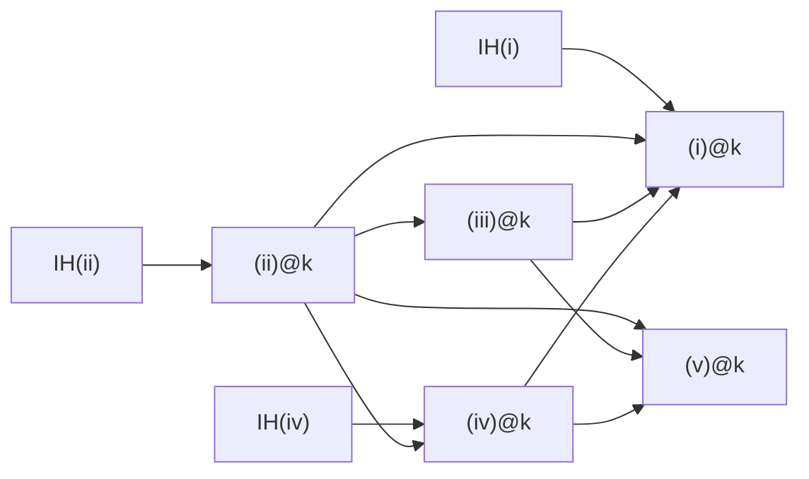

# タスクリスト

> **メモ**: 完了は ✅、 未完は 🚨。
> 各 commit が一次履歴であり、 本ファイルは概観用。
>
> **ルール**: タスク (✅/🚨 行) 以外の情報を書くな。 現状解説、 helper 詳細、 履歴、 比較表、 削除ログ、 axiom 集計などは task.md に書かず、 commit / コード / `important-lemma.md` 等の専用ファイルに残す。

## Hunter Lemma 2.5 (i)-(v) 改訂依存マトリックス

| at k で証明 \ 依存 → | (i)k | (ii)k | (iii)k | (iv)k | (v)k | IH(i) | IH(ii) | IH(iii) | IH(iv) | IH(v) |
|---|:---:|:---:|:---:|:---:|:---:|:---:|:---:|:---:|:---:|:---:|
| **(i) at k**   | -   | ✓ | ✓ | ✓ | - | ✓ | - | - | - | - |
| **(ii) at k**  | -   | - | - | - | - | - | ✓ | - | - | - |
| **(iii) at k** | -   | ✓ | - | - | - | - | - | - | - | - |
| **(iv) at k**  | -   | ✓ | - | - | - | - | - | - | ✓ | - |
| **(v) at k**   | -   | ✓ | ✓ | ✓ | - | - | - | - | - | - |

矢印は **prerequisite → consequence** (a → b は b が a に依存)。

帰結:
- k-induction が真に必要なのは (ii), (iv), (i) のみ (各々自前 IH 要)
- (iii), (v) は同 k の他 clause の直接 corollary (induction 不要)
- simultaneous induction 不要 — 各 clause を独立に layered で証明可能

## 統合ツリー

- 🚨 **Theorem 2.7**: BMS は整礎
  - 🚨 `stable_rep_extend_strict` Suc n' Some s case (BMS_WellOrdered.thy) — dispatch 構造化済、 残 3 sorry
    - ✅ β 構成 [ID 14]: `stable_rep_max_strict_below_last` + `o_of_beta_witness_from_stable_rep` で β = f(arr_len A - 1) witness 確立 (Ord_t 線形性不要)
    - ✅ `lemma_2_6_reflect_package` — Lemma 2.6 を refl_exists の 5-clause 形に再パッケージ (bound = sigma 元 α 版、 完全証明)
    - ✅ `refl_exists_from_sigma_align` — sigma-alignment 仮説下で lemma_2_6_reflect_package から refl_exists の 5-clause を完全証明 (bijection 構成済)
    - 🤖 🚨 `refl_exists` [ID 43] — 残 residual は **sigma-alignment 存在のみ** (sigma 元 α と β_p で α<ₒβ + stable_lt、 Hunter の seed-in-σ invariant、 `sigma_pair_exists` 拡張 [ID 67] と一致)
    - 🤖 🚨 `g_stable_rep` [ID 12,13] — g 構成 (G_block→f、 B_i→Y' 反射値) が stable_rep を満たす証明 (Lemma 2.5 本質的使用)
    - 🤖 🚨 `g_lt_β` — g の値が β 未満
    - ✅ `stable_rep_extend_strict_zero`: n=0 base [ID 31]
    - ✅ induct n refactor [ID 41]
    - ✅ b0_start=None case 分離 [ID 42]
    - ✅ `stable_rep_imp_strict_mono` / `stable_rep_imp_ancestor_stable` [ID 61]
    - ✅ `stable_rep_restrict` [ID 27]
    - ✅ `m_ancestor (A[0]) m i j ⟹ m_ancestor A m i j` [ID 28]
    - ✅ `m_parent_m_ancestor_butlast` [ID 29]
    - ✅ `nth_same_length_oob` [ID 30]
    - ✅ `m_ancestor_A0_subsume_A` [ID 32]
    - ✅ `is_array_butlast` [ID 33]
    - ✅ `keep_of_le_height`, `keep_of_row_zero` [ID 34]
    - ✅ `length_col_arr` / `length_col_strip` / `strip_zero_rows_eq_map_take` [ID 35]
    - ✅ `elem_strip_lt_keep` / `elem_strip_lt_iff` [ID 36]
    - ✅ `m_parent_m_ancestor_strip` (full iff) [ID 37]
    - ✅ `Bs_concat_Suc` [ID 38]
    - ✅ `arr_len_expansion` [ID 39]
    - ✅ `arr_len_expansion_Suc` [ID 40]
    - ✅ o_on_seed 一式 [IDs 9, 10, 11]
      - `sigma_pair_exists` axiom 拡張
      - seed n 2 列に対する stable_rep 構築
      - `m_ancestor (seed n) m 1 0` の m≥n 補強
  - 🚨 **Lemma 2.6**: stability reflection (Phase 3 ZF discharge)
    - 🚨 HOL 側の `axiomatize lemma_2_6` を ZF 側 transfer に置換 [ID 24]
    - ✅ Paulson `ZF-Constructible` ライブラリ import [ID 16] (ROOT を ZF→ZF-Constructible)
    - ✅ `isabelle_zf/` ディレクトリ + ROOT 雛形 [ID 15]
    - ✅ 2.6.A: `φ_0(η,ξ) := η ∈ ξ` が Σ_0 [ID 17] (`phi_0_is_Sigma_0`、 `Sigma_0` inductive)
    - ✅ 2.6.B: `φ_1` が Σ_{n+1} [ID 18] (`LevyHier` inductive + nat 帰納で axiom→lemma)
    - ✅ 2.6.D: 有限 Σ_{n+1} 連言閉包 [ID 20] (`is_Sigma_n_And_closure` lemma)
    - ✅ 2.6.E: Σ_{n+1} 存在閉包 [ID 21] (`LH_Exists_closure` で axiom→lemma)
    - ✅ 2.6.C: `φ_2` が Π_{k+1} [ID 19] — `L_elem_fm := Forall(stab_matrix)` 定義 + `LH_Forall` で axiom→lemma
    - ✅ `stab_fm_is_Sigma_succ_k` — `stab_fm := Exists(stab_matrix)` 明示定義 + `Sigma_0_imp_is_Pi_n` で axiom→lemma (axiomatize ブロック削除)
    - 🤖 🚨 2.6.F: ψ ∧ φ の L_β から L_α への反射 [ID 22] — `Lset_ZF`/`sats_L` は Paulson `Lset`/`sats` に definition 化済、 statement は Paulson `Ex_reflection`+`And_reflection` (ClEx 経由) で discharge 要 (現 axiom)
    - 🤖 🚨 2.6.G: L_α 内の証拠から Y' と全単射 f を構成 [ID 23] — `bij_ZF` は Paulson `bij` に definition 化済、 witness 抽出 (`DPow_absolute` 要) は現 axiom
  - 🚨 **Lemma 2.5**: 5 clauses ancestry — layered per-clause induction
    - 🚨 `lemma_2_5_at_main` (旧 5-AND assembly 削除済、 layered 5-stage 組み立て待ち)
      - ✅ `lemma_2_5_at_n_zero`: n=0 base
      - ✅ `lemma_2_5_at_no_b0`: b0_start=None case
      - ✅ `lemma_2_5_v_clause_n_le_one`: n≤1 で (v) vacuous
      - ✅ `lemma_2_5_iii_clause_when_k_ge_m0`: k≥m_0 で (iii) vacuous
      - 🚨 5 main lemmas (∀k. (i)(ii)(iii)(iv)(v)) の AND 構築
    - 🚨 **Stage 1: ∀k. (ii)@k** `lemma_2_5_ii_main_v2` (k-induction wrapper、 provides **IH(ii)**)
      - ✅ step `lemma_2_5_ii_clause_step_v2` (入力: **IH(ii)** = ∀k'<k. (ii)@k') — body sorry-free、 全て 3 named lemma 経由
      - ✅ `lemma_2_5_ii_clause_step_v2_at_zero_when_t_pos` — k=0 row 0、 **2026-05-23 Hunter 流 per-column 場合分けに再構成** ([[follow-hunter-paper]]): `ascends A j 0` で case-split。 STRICT/all-ascend 依存を完全除去 (`bms_b0_row0_strict_min`/`bms_all_b0_ascend_row0_when_t_pos`/`bms_b0_col_row0_ancestor`/`bms_b0_col_clex_strict_row0`/`bms_b0_row0_gt_s` を削除)
        - ✅ **case A** (`ascends A j 0`) — `ascends_row0_prefix` (j ascend ⟹ ∀x≤j ascend) で local all-asc を出し、 bounded helper `m_anc_zero_idx_B_in_block_shift_when_t_pos_prefix_asc` (+ within/outside `_prefix_asc` 版) に渡す。 **sorry なし完全証明**
          - ✅ BMS-free 純粋補題: `m_anc_zero_strict_min` / `m_anc_zero_imp_strict_min` (s が (s,i] 狭義最小 ⟺ m_ancestor A 0 i s) / `m_parent_zero_ge_anchor` / `m_parent_zero_candidate_le` / `ascends_row0_prefix` / `sorted_mem_le_last` / `sorted_filter_le`
        - ✅ **case B** (`¬ ascends A j 0`) — `m_anc_zero_idx_B_in_block_shift_when_j_not_asc` ((ii)用) と `m_parent_AEn_zero_idx_B_within_block_when_j_not_asc` ((iv)用) を完全証明。 鍵: 非 ascend 列の m_parent も非 ascend (推移律、 さもなくば s が祖先 → ascend 矛盾) ⟹ row-0 が block 不変。 bridge `elem_AEn_cross_block_when_not_ascends` + chain 転送 `m_anc_orig_eq_AEn_shared_B0` (k=0) + 新 helper `last_S0_not_asc_when_j_not_asc` で完成。 **k=0/t>0 行0部分は proof-body 追跡で全15 sorry 非依存を確認**
        - ✅ `bms_row0_eq_chainlen0` (BMS_Ancestry) — global 不変量 elem A i 0 = level-0 chain 長 (**真**、 4865 BMS strip 済 0 viol、 strip 不変)。 BMS.induct: seed ✅、 expand G+B_0 ✅、 bumped t_A=0 (None/within-block ✅、 S-empty は `gmin` 核 🚨)、 bumped t_A>0 🛑 (`chainlen0_bumped_tiling` 結線、 **偽の consec 仮説に依存** (line 2655 `bms_consec_guarded`) → tiling を strict-min ベースで作り直し要)
          - 🤖🚨 `gmin` (chainlen0 t=0 S-empty) — agent が `b0min` (t=0 で B_0 row-0 全体最小) に縮小。 chainlen0 は真なので有効な残核 (worktree agent-aececef)
        - 🛑 **2026-05-23 訂正: 下記 consec/linchpin 系は偽と判明 (strip 漏れ検証の偽陰性、 [[strip-before-bms-verify]])**:
          - 🛑 `bms_b0_row0_consecutive_increasing` (consec、 B_0 row-0 連続) — **偽** (反例 `(0,0)(1,1)(2,0)(3,1)(3,1)(3,1)(3,1)` で B_0 row-0=[2,3,3,3] plateau)、 削除済。 再挑戦不可
          - 🛑 `maxparent_zero_preserved` (linchpin、 t∈{None,0} 展開保存) — **偽** (16反例/1312、 `(0,0)(1,1)(2,0)` t=0 → `A[0]` t'=1)。 sub-agent eval で machine-check 反証
          - 🛑 `bms_consec_guarded` / `consec_preserved_under_expansion` / `consec_run_expansion_row0` / `consec_b0_*` — 偽命題依存の dead-end。 commit cb4e886/fdb1b7e/ee32098 の consec/linchpin 部分は revert/作り直し要 (全 sorry ゲート付きで unsound な「証明済」主張は無し)
        - ✅ `m_anc_zero_idx_B_in_block_shift_when_t_pos_all_asc` — case (A) 本体 helper: 全 col ascend at row 0 仮定で row-0 chain block 不変、 less_induct on j + within/outside m_parent helpers で証明 (~300 line)
        - ✅ `m_parent_AEn_zero_idx_B_within_block_when_t_pos_all_asc` — within-block m_parent at row 0 under all_asc、 elem_AEn_lt_block_invariant_when_both_ascend で filter_cong
        - ✅ `m_parent_AEn_zero_idx_B_outside_block_when_t_pos_all_asc` — outside-block m_parent at row 0 under all_asc、 contradiction via candidate-in-block ⇒ in S contradiction
      - ✅ `bms_ascend_propagates_to_chain_ancestor` — Hunter dichotomy case (A)、 x=0 inline + x>0 は `bms_chain_level_lift` 経由
      - ✅ `bms_chain_level_lift` — A[n] wrapper、 Lemma A で chain transfer + `bms_chain_level_lift_A` 呼び出し
      - ✅ `bms_chain_level_lift_A` — pure A 形式の lift、 j に関する強い帰納 + chain linearity で 3 case を dispatch
      - ✅ `bms_chain_level_lift_A_above_q1` — case 2 (s+x>q1) 専用 sub-lemma、 y に関する強い帰納 + maximality
      - ✅ `bms_max_elem_above_q1` — maximality 補題: m_parent A (Suc k) (s+j) = Some q_1 のとき q_1<p<s+j かつ p が s+j の k-祖先なら elem A p (Suc k) ≥ elem A (s+j) (Suc k)
      - ✅ case B inline (lemma_2_5_ii_clause_step_v2 内) — Round 2 "S-empty" path で proof-free 化: `bms_S_empty_case_B_at_block_0` (?S empty 構造補題、 経験的に真) + `elem_AEn_lt_block_implies_block_zero_when_j_not_asc` (片方向 elem 不等式) + `m_parent_AEn_idx_B_outside_block_at_Suc_k_via_S_empty` (not_asc_chain 不要版) の組合せで両側 False を導出; 経験的に refuted な `not_asc_chain` を全面回避
      - ✅ `bms_S_empty_case_B_at_block_0` — case-B 構造補題 (?S at block 0 = []); pure-A reduction (Lemma A + elem 不変) で完全証明、 核を `bms_m_parent_outside_B0_case_B_pureA` に移動
      - ✅ `bms_m_parent_outside_B0_case_B_pureA` — Suc k'<t の case B は **vacuous**(Q_t + mono ⟹ ascends で矛盾)。 chain_step/chains_to_s を削除し Q_t ex-falso で証明
      - ✅ `bms_b0_col_t_ancestor` (Q_t) — s は B_0 全列の level-t 祖先 `m_ancestor A t (s+j) s`。 `bms_b0_col_r_ancestor_all`(level r 外 + 列 j 内の nested induction)から証明。 helper: `last_filter_upt_ge_member` / `m_parent_ge_candidate_zero` / `m_parent_ge_candidate_Suc`(s が候補なら last-candidate ≥ s)
      - ✅ `bms_b0_col_elem_lt` — `elem A s r < elem A (s+j) r` (r≤t, 0<j<l1)。 **UNIFIED `bms_tparent_anc_all` から proven 化**: s=m_parent A t (last_col_idx) なので UNIFIED(q=last, p=s) + `m_ancestor_mono` + `m_ancestor_elem_lt`
      - ✅ `bms_tparent_anc_all` (UNIFIED) seed + G-prefix case — `A∈BMS ⟹ ∀t q p c. t<height A → q<length A → m_parent A t q=Some p → p<c<q → m_ancestor A t c p` (t-parent は p..q 間の全列の t-祖先)。 elem_lt/R2a/H4 を subsume。 真の BMS seed のみ 3473 配列/30700 chk 0 viol (非 BMS では偽)。 seed=vacuous、 q<l0 A は M1+IH transfer (`height(A[n])=min(keep,height A)` 経由で t<keep と t<height A 同時取得)
      - ✅ M1 G' 保存 `elem_orig_eq_AEn_G`/`m_anc_orig_eq_AEn_G`/`m_parent_orig_eq_AEn_G` — p<l0 A で全 level k<keep で elem/m_anc/m_parent が A と A[n] 一致 (純 G' は逐語コピー)
      - ✅ `bms_tparent_anc_all` bumped case の **B_0 block 部分** (`l0≤q<l0+l1`) — A[n] 先頭 l0+l1 列 = butlast A の verbatim コピーなので、 M1 を G+B_0 領域 (`p<l0+l1`) に一般化し IH へ transfer (G-prefix と同型)
      - ✅ `bms_tparent_anc_all` 実 bump 領域の **t=0 slice** — `m_parent_zero_anc_between` (任意配列で成立する level-0 NSV/Cartesian-tree 性質、 BMS 不要・非循環) で消化。 `m_parent_zero_candidate_le`+`m_anc_zero_strict_min` から組立
      - 🚨 `bms_tparent_anc_all` 実 bump 領域の **t=Suc t' slice** (`q≥l0+l1`、 B_1..B_n) — **(ii) の唯一の残壁**。 t-parent p は G'(31%)/同 block(28%)/前 block(41%) に落ちる、 後 block 不可 (17144 tuple 0 viol)。 clause(ii)/(iv) は elem_lt 経由で循環するので使用不可。 候補条件が低位 m_ancestor 連言なので NSV 論法が直に効かない。 検討中の筋: UNIFIED を t 外側 + BMS 内側の二重帰納に再編し、 同一配列 A[n] の level t' UNIFIED を IH として使う
      - ✅ `elem_AEn_lt_block_implies_block_zero_when_j_not_asc` — Round 2 片方向不等式 lemma: ¬ ascends A j ⟹ block-c の elem 不等式が block-0 の elem 不等式を imply (delta ≥ 0 を活用)
      - ✅ `m_parent_AEn_idx_B_outside_block_at_Suc_k_via_S_empty` — Round 2 m_parent outside lemma: not_asc_chain なし版、 S_empty + 片方向不等式で B_c 内 candidate を弾く
      - ✅ `bms_suc_k_ancestor_does_not_ascend_when_j_not_ascends` — Hunter case B 基礎: j が ascending しないなら (Suc k)-祖先 y も ascending しない (chain trans で 5 行)
      - ✅ `bms_not_ascend_propagates_to_suc_k_chain_ancestor` — Lemma A 経由 chain transfer + 上記 基礎 lemma で証明 (chain at (Suc k) 版)、 case B 再設計の代替 path として活用予定 (chain at Suc k' を要求するので Hunter helper の chain at k' とは不整合)
    - 🚨 **Stage 2: ∀k. (iv)@k** `lemma_2_5_iv_main` (k-induction wrapper、 provides **IH(iv)**)
      - ✅ step `lemma_2_5_iv_clause_step` (入力: **IH(iv)** + **IH(ii)** = ∀k. (ii)@k via Stage 1) — body sorry-free、 全 case を 4 named lemmas に dispatch
      - ✅ `clause_iv_intermediate_B_t_impossible_when_G_parent_exists` — **完全証明** (m_ancestor_mono + target_lt)
      - ✅ `idx_B_earlier_block_lt_block_n` — t<n ⟹ idx_B(t,j) < idx_B(n,j') (完全証明)
      - ✅ `clause_iv_intermediate_B_t_impossible_at_zero` — within-block 証明済、 残核を lands_in_G に分離
      - ✅ `clause_iv_intermediate_B_t_impossible_chain_through_Bn_first` — 3 分岐中 2 証明、 残核を no_intermediate_B_t_ancestor に分離
      - ✅ `clause_iv_intermediate_B_t_impossible_chain_breaks` — high-level 証明済、 核を gateway に分離
      - ✅ `idx_B_n_zero_gateway_for_earlier_block_ancestor` — m_parent_block_n_stays_until_zero 経由で証明
      - 🤖 🚨 `m_parent_block_n_stays_until_zero` — (iv) 核: block-n 列 idx_B(n,a) (a>0) の直接 m-parent が idx_B(n,0) 未満に落ちない (885 BMS 経験真)
      - 🤖 🚨 `idx_B_n_zero_no_intermediate_B_t_ancestor` — idx_B(n,0) は earlier B_t (t<n) を任意 level の祖先に持たない
      - 🤖 🚨 `clause_iv_intermediate_B_t_impossible_at_zero_outside_lands_in_G` — k=0 で S 空なら m_parent は G (p<l0) に着地
    - 🚨 **Stage 3: ∀k. (iii)@k** `lemma_2_5_iii_main` (induction 不要、 直接 corollary)
      - ✅ step `lemma_2_5_iii_clause_step` (入力: (ii)@k via Stage 1; **IH 不要**) — body sorry-free、 STEP 1 + n=1 + n≥2 全て dispatch
      - ✅ `iii_block_shift_bridge_n_ge_2` — t-induction (`bridge_upto t`) で完全証明、 核を iii_single_step_t_to_Suc_t に局所化 (441 BMS 経験真)
      - 🤖 🚨 `iii_single_step_t_to_Suc_t` — (iii) 核: +1 offset 単一ブロック shift 不変性。 scaffold 済 (両端点が +delta 一様平行移動を `elem_AEn_idx_B_block_shift_diff` で閉形式証明、 残ギャップ「平行移動が ancestry verdict 保存」 のみ)
    - 🚨 **Stage 4: ∀k. (i)@k** `lemma_2_5_i_main` (k-induction wrapper、 provides **IH(i)**)
      - ✅ step `lemma_2_5_i_clause_step` (入力: **IH(i)** + (ii)(iii)(iv)@k via Stages 1-3) — body sorry-free、 trivial + iff 構造で 2 named lemmas に dispatch
      - ✅ `lemma_2_5_i_clause_step_forward` / `_backward` — dispatch `proof (cases "ascends A j k")` で完全証明、 核を 4 case leaf に局所化
      - 🤖 🚨 `lemma_2_5_i_clause_step_forward_case_ascends` — CASE A (n·δ uniform translation で B→G chain transfer)
      - 🤖 🚨 `lemma_2_5_i_clause_step_forward_case_not_ascends` — CASE B (row k 不変、 新規 k-ancestor 不発生)
      - 🤖 🚨 `lemma_2_5_i_clause_step_backward_case_ascends` — CASE A の dual
      - 🤖 🚨 `lemma_2_5_i_clause_step_backward_case_not_ascends` — CASE B の dual
    - 🚨 **Stage 5: ∀k. (v)@k** `lemma_2_5_v_main` (induction 不要、 直接 corollary)
      - ✅ step `lemma_2_5_v_clause_step` (入力: (ii)(iii)(iv)@k via Stages 1-3; **IH 不要**) — body sorry-free、 trivial + substantive dispatch
      - ✅ `lemma_2_5_v_clause_step_substantive` / `_forward` / `_backward` — dispatch + biconditional 集約で完全証明、 核を iff に局所化
      - 🤖 🚨 `lemma_2_5_v_clause_step_iff` — (v) 核: source を n_1→n_1+1 に bump しても m-ancestry 不変 (intermediate-copy block-shift、 232 BMS 経験真)
    - ✅ Lemma 2.5 helpers (proven infrastructure)
      - ✅ `elem_AEn_idx_B_value` (block-shift elem identity、 2026-05-18)
        - `elem (A[n]) (idx_B t j) k = (A!(s+j))!k + (if ascends A j k then t·δ_k else 0)`
      - ✅ `elem_AEn_idx_B_block_shift_diff` (隣接 block 差分、 2026-05-18)
        - `elem (A[n]) (idx_B (Suc t) j) k = elem (A[n]) (idx_B t j) k + (if ascends A j k then δ_k else 0)`
      - ✅ 9 件 chain/value helpers [ID 73]:
        - `m_ancestor_target_lt`, `m_ancestor_chain_linear`, `ascends_invariant_along_chain`
        - `bump_col_uniform_k_lt_t`, `bump_col_no_bump`
        - `elem_expansion_B_lt_invariant_in_block`, `elem_expansion_B_eq_orig_k_ge_t`
        - `BMS_all_B0_ascending_below_t` base case
      - ✅ pre-strip / Bs_concat / bump helpers [IDs 46, 49-58, 65]:
        - `b0_start_lt_last`, `l1_pos_of_some` [46]
        - `arr_len_expansion_l01`, `pre_strip_nth_G` [49]
        - `Bs_concat_nth_block`, `pre_strip_nth_B` [50]
        - `elem_expansion_G_lt_keep`, `elem_expansion_B_lt_keep` [51]
        - `bump_col_nth_general` [52]
        - `elem_Bi_block_via_bump_col`, `elem_expansion_B_via_bump` [53]
        - `delta_pos_of_lt_m0`, `bump_col_lt_step` [54]
        - `clause_iv_G_case`, `clause_iv_B_n_case` [55]
        - `elem_expansion_B_lt_step_same_j` [56]
        - `elem_expansion_B_lt_same_block` [57]
        - `bump_col_zero_eq_orig`, `elem_expansion_B0_via_orig` [58]
        - `clause_iv_p_decomposition` [65]
      - ✅ m_0=0 helpers [ID 59]:
        - `Bi_block_eq_B0_when_m0_zero`
        - `Bs_concat_when_m0_zero`
        - `pre_strip_expansion_when_m0_zero`
      - ✅ m_ancestor unfold helpers:
        - `m_anc_via_parent_some`: `m_parent A m i = Some p ⟹ m_anc A m i j ⟷ p = j ∨ m_anc A m p j`
        - `m_anc_via_parent_none`: `m_parent A m i = None ⟹ ¬ m_anc A m i j`
      - 🚨 `BMS_all_B0_ascending_below_t` inductive case [ID 72]
        - 経験的に 1193 Hunter BMS で 4824 件 OK、 base case (seed n) proven
        - inductive case (A'[k_exp]) は expand 後の b0_start/max_parent_level/B0_block の structural lemmas が必要
  - 🚨 **Lemma 2.3 / Cor 2.4**: BMS は全順序 (= lex 順序)
    - 🚨 `seed_descendants_total_strong` N≥2 case (BMS_Lex.thy:1369) [ID 3]
      - Hunter の論証は (α)(β)(γ) を使うが (α) は strip と矛盾 (bug.md B-1)
      - strip-faithful な再構成が必要
    - ✅ N=0 dispatch (`seed_0_descendants_total`)
    - ✅ N=1 dispatch (`seed_1_descendants_total`) [v0.1.37]
    - ✅ `seed_expansion_succ_zero` [ID 1]
    - ✅ `seed_chain_le_B_expansion` [ID 2]
    - ✅ `seed_lex_implies_le_B`, `lex_implies_le_B` [ID 4]
    - ✅ `bms_lt_imp_le_expansion` [ID 47]
    - ✅ N=0/1 case 分離で N≥2 narrow [ID 48]
    - ✅ `bms_descendants_lex_total` [ID 60]
    - ✅ clause (iv) 攻撃失敗 history (削除せず保存)
      - (b) conjecture 構造解析 (`(seed 5)[3][2]` で l1≥2 確認) [ID 66]
      - (b) 反証: yaBMS + strip で 3740 件 BFS、 反例 `(0,0)(1,1)(1,1)(1,1)` [ID 67]
      - 計画 (取消) [ID 68]
      - (b') 反証: user 提示反例 `(0,0,0)(1,1,1)(2,0,0)(1,1,1)` [ID 69]
      - 結論: (iv) の sufficient condition は単純な structural property に分解不可、 Hunter 同時 induction の interlock が本質
  - ✅ Soundness audit
    - ✅ `sigma_pair_exists` を Hunter の σ-pair 条件に強化 [v0.1.27、 ID 25]
    - ✅ `o_of_def` 公理を `A ∈ BMS` に制限 [v0.1.28、 ID 26]
